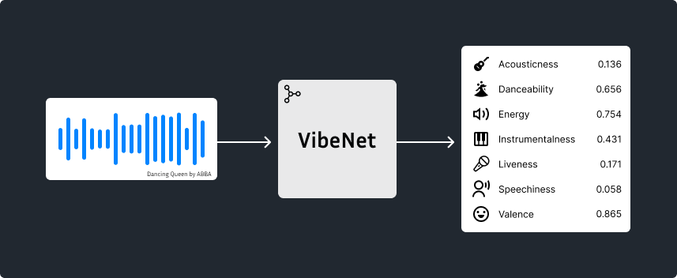

# VibeNet: Music Emotion Prediction

<p align="center">
  
</p>

A while ago I canceled my Spotify subscription and began building my own offline music library. But something I always missed was Spotify's ability to generate smart playlists like *Morning Mix* or *Driving Vibes*. Spotify doesn't publish how its algorithm creates these playlists, so I set out to build my own system.

As humans, music can make us feel happy, sad, energetic, angry, calm, or a variety of other emotions. Can music make computers *feel* these emotions too? Well, maybe not, but we can teach them to recognize and quantify the qualities of music that drive those feelings. Then, we could use our computers to classify and organize our musical tracks by the emotions they make us feel and recommend songs that match a given mood.

VibeNet is a lightweight Python package and CLI that predicts musical emotions and attributes (valence, energy, danceability, acousticness, etc.) directly from raw audio. It utilizes a distilled EfficientNet student model trained with teacher-student distillation on the [Free Music Archive (FMA) dataset](https://github.com/mdeff/fma).

## Quick Links

There are a few different ways to use VibeNet depending on your intended use case.

- [Beets plugin](#beets-plugin) - By far the best option for using VibeNet to tag and classify your personal music collection
- MusicBrainz Picard - Coming soon!
- [Python package]() - Best if you want to build on top VibeNet or you need the maximum flexibility
- [Command line (CLI)](#command-line) - Best for one-off labeling tasks. I wouldn't use the CLI to label and manage your entire library

## What attributes are predicted?

VibeNet predicts 7 continuous attributes for each audio track: **acousticness**, **danceability**, **energy**, **instrumentalness**, **liveness**, **speechiness**, and **valence**.

Some features (like acousticness, instrumentalness, and liveness) are **likelihoods**: they represent probabilities of that characteristic being present (e.g. probability the track is acoustic). Others (like danceability, energy, valence) are **continuous descriptors**: they describe how much of the quality the track has.

For example, an acousticness value of 0.85 doesn't mean that 85% of the track is composed of acoustic instruments. It means that it's highly likely that the recording is acoustic and not electronic.

Conversely, an energy value of 0.15 doesn't mean that it's highly unlikely that the song is energetic. It reflects a degree of the quality itself, meaning that the track is overall perceived as having very low intensity.

Below is a table describing each attribute in more detail:

| Attribute | Type | Description |
|---|---|---|
| **Acousticness** | Likelihood | A measure of how likely a track is to be acoustic rather than electronically produced. High values indicate recordings that rely on natural, unprocessed sound sources (e.g. solo guitar, piano ballad, etc.). Low values indicate tracks that are primarily electronic or produced with synthetic instrumentation (e.g. EDM, trap, etc.) 
| **Instrumentalness** | Likelihood | Predicts whether a track contains no vocals. Higher values suggest that the track contains no vocal content (e.g. symphonies), while lower values indicate the the presence of sung or spoken vocals (e.g. rap).
| **Liveness** | Likelihood | A measure of how likely the track is to be a recording of a live performance. Higher values suggest the presence of live-performance characteristics (crowd noise, reverberation, stage acoustics), while lower values suggest a studio recording.
| **Danceability** | Descriptor | Describes how suitable a track is for dancing. Tracks with higher values (closer to 1.0) tend to feel more danceable while, lower values (closer to 0.0) may feel less danceable.
| **Energy** | Descriptor | Also known as arousal. Measures the perceived intensity and activity level of a track. Higher values indicate tracks that feel fast, loud, and powerful, while lower values indicate tracks that feel calm, soft, or subdued.
| **Valence** | Descriptor | Measures the musical positivity conveyed by a track. Higher values indicate tracks that sound more positive (e.g. happy, cheerful, euphoric), while lower values  indicate tracks that sound more negative (e.g. sad, depressed, angry).
| **Speechiness** | Descriptor | Measures the presence of spoken words in a track. Higher values indicate that the recording is more speech-like (e.g. podcasts), while lower values suggest that the audio is more musical, with singing or purely instrumental content. Mid-range values often correspond to tracks that mix both elements, such as spoken-word poetry layered over music.

## Usage
### Beets Plugin
<details>
<summary>
Click to expand
</summary>

#### Installation

Install the VibeNet package into the same virtual environment as your beets installation

```
pip install vibenet
```

and activate the plugin by adding it to your beets configuration (Run `beet config -e` to edit your config file)

```
plugins:
    - vibenet
```

#### Configuration
To configure the plugin, make a `vibenet:` section in your beets configuration file. For example:
```
vibenet:
    auto: yes
    force: no
    threads: 0
```

- **auto**: Enable VibeNet during `beet import`. Default: `yes`
- **force**: Perform prediction on tracks that already have all fields. Default: `no`
- **threads**: The number of CPU threads to use for inference. Default: all available threads

#### Usage
By default, the plugin tags files automatically during import. You can optionally run the vibenet command manually. For a list of all CLI options:

```
beet vibenet --help
```

Once your files are tagged, you can do some pretty cool things with beets. For example, if I wanted to find all songs by ABBA with a high valence score:

```
beet ls artist:=ABBA valence:0.7..
```

Or to build a party playlist of upbeat tracks:

```
beet ls valence:0.6.. energy:0.7..
```

Or maybe a calm but inspirational study playlist composed of instrumental tracks:

```
beet ls instrumentalness:0.9.. energy:..0.3 valence:0.8..
```

To get the most out of beets, you should understand [how its query strings work](https://beets.readthedocs.io/en/stable/reference/query.html).
</details>

### Command Line
<details>
<summary>
Click to expand
</summary>
The VibeNet package includes a command line script as well.

#### Installation
Install the VibeNet package.

```
pip install vibenet
```

#### Usage
Use `vibenet --help` to get a full explanation of usage format. Below are a few examples:

**Output predictions for a single file**
```
$ vibenet '02 Dancing Queen.flac' 
Predicting ━━━━━━━━━━━━━━━━━━━━━━━━━━━━━━━━━━━━━━━━ 100% 0:00:00
┏━━━━━━━━━━━━━━━━━━┳━━━━━━━━━━━━━━┳━━━━━━━━━━━━━━┳━━━━━━━━┳━━━━━━━━━━━━━━━━━━┳━━━━━━━━━━┳━━━━━━━━━━━━━┳━━━━━━━━━┓
┃ path             ┃ acousticness ┃ danceability ┃ energy ┃ instrumentalness ┃ liveness ┃ speechiness ┃ valence ┃
┡━━━━━━━━━━━━━━━━━━╇━━━━━━━━━━━━━━╇━━━━━━━━━━━━━━╇━━━━━━━━╇━━━━━━━━━━━━━━━━━━╇━━━━━━━━━━╇━━━━━━━━━━━━━╇━━━━━━━━━┩
│ 02 Dancing       │ 0.344        │ 0.620        │ 0.704  │ 0.714            │ 0.160    │ 0.045       │ 0.882   │
│ Queen.flac       │              │              │        │                  │          │             │         │
└──────────────────┴──────────────┴──────────────┴────────┴──────────────────┴──────────┴─────────────┴─────────┘
```

**Process a whole directory, and output the results in CSV format**
```
$ vibenet -f csv *
Predicting ━━━━━━━━━━━━━━━━━━━━━━━━━━━━━━━━━━━━━━━━ 100% 0:00:00
path,acousticness,danceability,energy,instrumentalness,liveness,speechiness,valence
04 Dum Dum Diddle.flac,0.4607604851395908,0.6557254791259766,0.4954206943511963,0.5706152901750524,0.14939714126869905,0.04425659030675888,0.9304299354553223
10 Arrival.flac,0.7492030794013365,0.3940376341342926,0.3149440884590149,0.909781333152513,0.16115917859422296,0.06442416459321976,0.07757408916950226
01 When I Kissed the Teacher.flac,0.4503387044857127,0.574401319026947,0.6448520421981812,0.3958653381113854,0.1827700968370561,0.039843928068876266,0.8254069089889526
07 That’s Me.flac,0.18465114617230102,0.6521217226982117,0.6456546187400818,0.6775099224832243,0.17600368615142495,0.057180166244506836,0.8024619817733765
"06 Money, Money, Money.flac",0.6901674220217361,0.6556591987609863,0.4812447428703308,0.7523727231956888,0.14662341130452025,0.06765997409820557,0.9115567207336426
09 Tiger.flac,0.3625403656002167,0.5708804130554199,0.6882965564727783,0.6308650228026009,0.179473740246014,0.044405993074178696,0.8011720180511475
08 Why Did It Have to Be Me.flac,0.8084378055338943,0.5141943693161011,0.5882516503334045,0.7828053421798725,0.16900709319657073,0.03991405665874481,0.8868117332458496
"05 Knowing Me, Knowing You.flac",0.20703727138284786,0.6520654559135437,0.5237798690795898,0.44584756563169287,0.16008894555350467,0.05200740322470665,0.8240906000137329
"03 My Love, My Life.flac",0.803182653487076,0.4552169442176819,0.23595675826072693,0.6472388734467308,0.1453882503527327,0.03054790198802948,0.1411082148551941
02 Dancing Queen.flac,0.34442428835652833,0.6195424795150757,0.7037929892539978,0.7138845214492101,0.1604615680649649,0.04466772451996803,0.8822445869445801
```
</details>